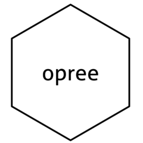
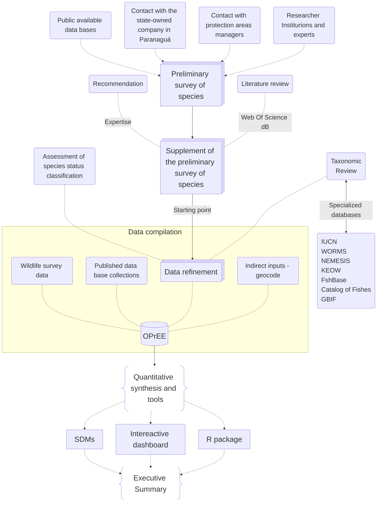

Language: [English](README.md) | [Portuguese](README_PTBr.md)
<!-- header -->
# opree:Obervatorio Paranaense de Espécies Exóticas <a href=""></a> 

Opree is a collaborative, continuous-flow project designed to aggregate biological and geographic data for exotic species in the state of Paraná. Toghether with the support of the state's network of experts on exotic and invasive species, **opree** integrates and stores information originating from public and private databases to form the foundation of the **Paraná Observatory of Exotic Species**.

## Package structure
The database contains approximately **25,000** records of occurrences of non-native species collected for the state of Paraná.
The database uses information from multipĺe research projects, studies and scientific literature, specialized databases, and ongoing research projects to compile geospatial observation data of exotic species.
The organization level of collecting information is reported in the flowchart:



## Package Features

### Installation
Although the package is hosted in the `ObservatorioPR` repository, the package name is `opree`. Therefore, after installing via the repository, it is necessary call the `opree` library.

```r
#install depencies
install.packages(devtools)
#install package
devtools::install_github("RicardoAdelino/ObervatorioPR")
#load package 
library(opree)
```